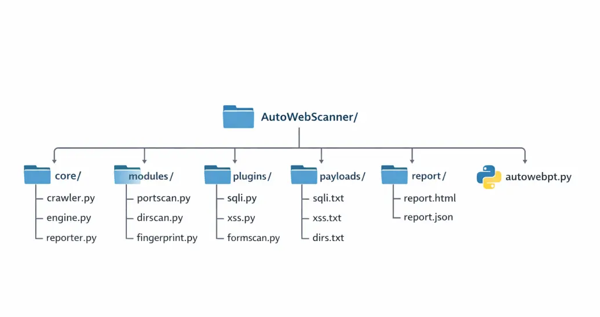
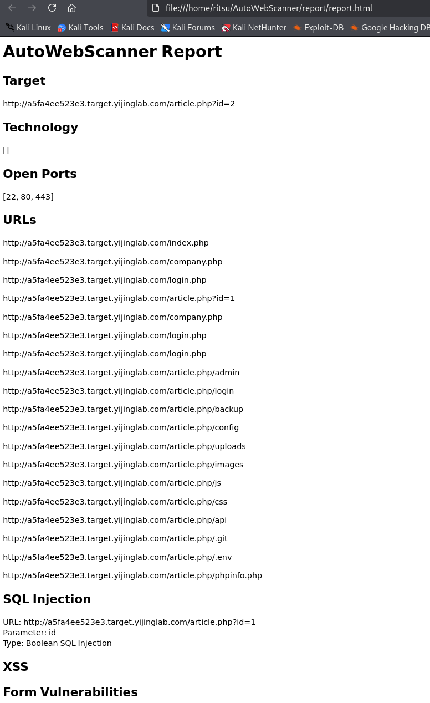

#  AutoWebScanner - 自动化 Web 漏洞扫描器

##  项目简介
AutoWebScanner 是一个基于 Python 开发的自动化 Web 漏洞扫描工具，支持对目标网站进行端口扫描、目录扫描、SQL 注入检测（布尔盲注）和 XSS 检测，并生成结构化扫描报告。

本项目旨在模拟真实安全工具（如 sqlmap / Burp Suite）的核心功能，用于学习 Web 安全与自动化渗透测试。

---

##  项目亮点

- 基于插件化架构的漏洞扫描引擎
- 实现布尔盲注 SQL 注入检测
- 支持多线程扫描，提高效率
- 自动爬取网站并识别参数
- 支持 HTML / JSON 报告输出

---

##  功能特性

-  端口扫描（基于 nmap）
-  网站爬虫（自动收集 URL）
-  目录扫描（字典爆破）
-  SQL 注入检测（支持布尔盲注）
-  XSS 漏洞检测
-  HTML / JSON 报告生成
-  多线程扫描（提升效率）
-  插件化架构（易扩展）

---

##  技术栈

- Python 3
- requests
- BeautifulSoup4
- python-nmap
- urllib
- ThreadPoolExecutor
- HTML / JSON 报告生成

---

##  项目结构

---

##  使用方法

### 1️⃣ 安装依赖

pip install requests beautifulsoup4 python-nmap --break-system-packages
sudo apt install nmap

---

### 2️⃣ 启动扫描

python autowebpt.py -u http://target

示例：

python autowebpt.py -u http://127.0.0.1/DVWA

---

### 3️⃣ 查看扫描报告

firefox report/report.html

---

##  测试环境

- DVWA（Damn Vulnerable Web Application）
- 本地 Web 测试环境
- 在线靶场环境

---

##  示例功能说明

### SQL 注入检测
- 自动识别 URL 参数
- 构造 True / False 条件
- 通过页面响应差异判断是否存在布尔盲注漏洞

##  SQL 注入检测原理

本工具基于布尔盲注实现：

- 构造 True / False 条件
- 对比页面返回内容差异
- 判断参数是否存在注入点

### XSS 检测
- 注入常见 XSS payload
- 检测返回页面是否回显 payload

### 目录扫描
- 使用字典进行路径爆破
- 发现隐藏目录和敏感文件

---

##  扫描结果

扫描完成后会生成：

- report/report.html（可视化报告）
- report/report.json（结构化数据）

报告包含：

- 目标信息
- 开放端口
- 发现的 URL
- SQL 注入漏洞
- XSS 漏洞
- 表单漏洞

##  使用示例

python autowebpt.py -u "http://a5fa4ee523e3.target.yijinglab.com/article.php?id=2"

##  扫描结果示例

---

## ⚠️ 注意事项

- 本工具仅用于安全学习与研究
- 请勿用于非法扫描或攻击行为
- 扫描真实网站前请确保拥有授权

---

##  后续优化方向

- 支持时间盲注（Time-based SQLi）
- 自动登录 / Session 维持
- WAF 绕过
- API 接口扫描
- 子域名扫描

